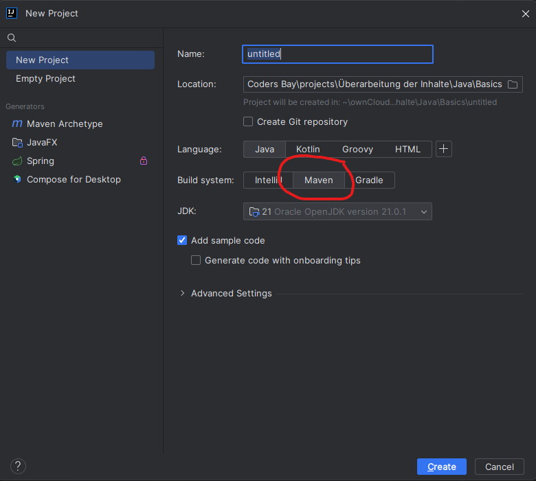
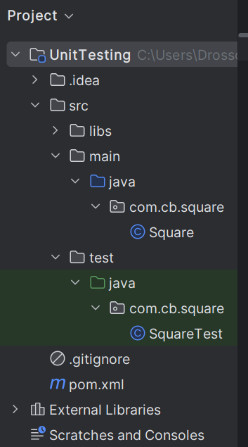
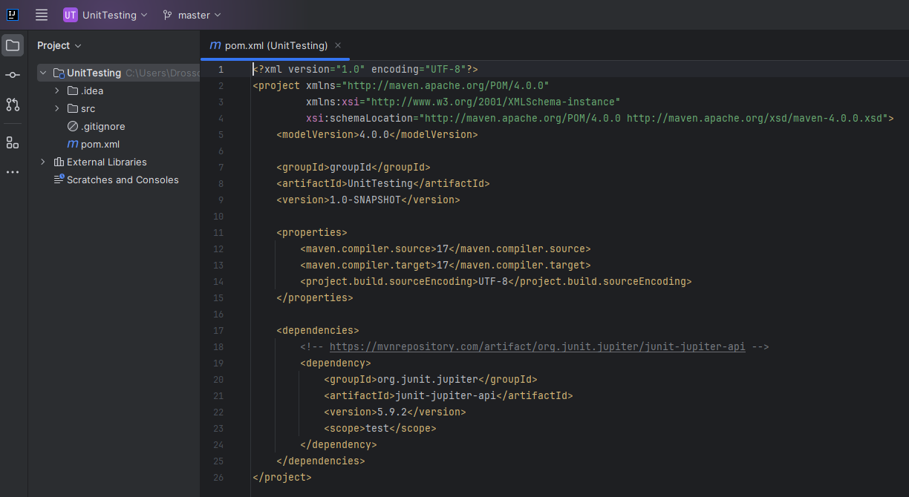

# Einrichtung der Entwicklungsumgebung

Um einen `Unittest` schreiben zu können müssen zuerst die richtigen Libraries eingebunden werden.

## Java

Um in Java Unittests erstellen zu können müssen wir zuerst ein sogenanntes Maven-Projekt erstellen. Mit den folgenden Einstellungen gelingt es:



### Dependencies registrieren

In MAVEN-Projekten werden die Abhängigkeiten in ein sogenanntes `pom.xml`-File zusammengestellt. Diese Datei ist im Root-Ordner des Projekts zu finden.



> [!IMPORTANT]
> Bei jeder Änderung im `pom.xml`-File müssen die Dependencies neu geladen werden. Das erkennt man in IntelliJ daran, dass die neu eingetragenen Dependencies in roter Schrift dargestellt werden. 
> Im IntelliJ-Fenster des `pom.xml`-Files oben rechts erscheint folgendes Icon: 

Um die entsprechende benötigte Library zu registrieren, muss man diese Datei editieren und folgendes im Block `<dependencies>` hinzufügen:

`pom.xml`
```xml
        <dependency>
            <groupId>org.junit.jupiter</groupId>
            <artifactId>junit-jupiter-api</artifactId>
            <version>5.9.2</version>
            <scope>test</scope>
        </dependency>
```

Ein einfaches `pom.xml`-File für Unittests würde in folgendem Beispiel so ähnlich aussehen:



> [!INFORMATION]
> Die Versionsnummern sind natürlich entsprechend der benötigten Version anzupassen.

## C#

In C# werden Unittests anders erstellt. Dies wird in folgendem Tutorial von Microsoft beschrieben: [Unittest-Projekt anlegen](https://learn.microsoft.com/de-de/visualstudio/test/getting-started-with-unit-testing?view=vs-2022&tabs=dotnet%2Cmstest)

Weiters bietet Visual Studio ebenfalls die Möglichkeit, Libraries einzubinden. Diese werden `Verweis` oder `Projektverweis` (in englisch `Reference` oder `Projekt Reference`) genannt. Im folgenden Microsoft-Tutorial wird erklärt, wie diese verwaltet werden: [Verwalten von Verweisen in einem Projekt](https://learn.microsoft.com/de-de/visualstudio/ide/managing-references-in-a-project?view=vs-2022)

Zurück zur [Startseite](README.md)