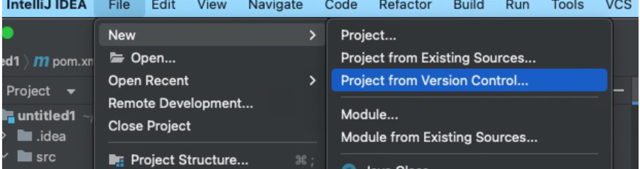
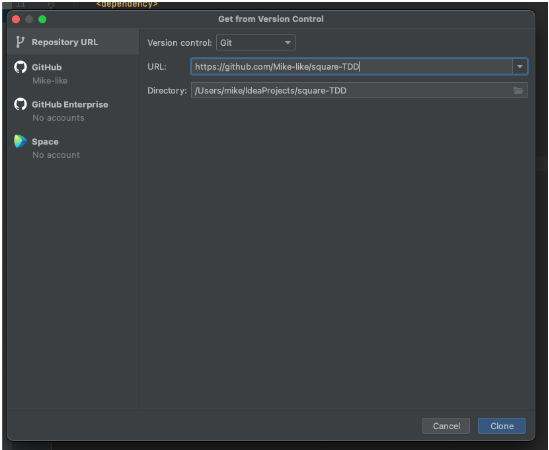

# Wie lade ich ein Projekt von GITHub herunter?

In IntelliJ: File -> New -> Project from Version Control...

In das folgende Fenster einfach die URL zum GITHub-Repository einfügen und auf *Clone* klicken:

