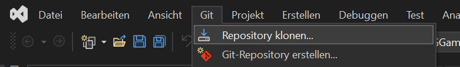

# Wie lade ich ein Projekt von GITHub herunter?

## In IntelliJ / Java

In IntelliJ: `File -> New -> Project from Version Control...`

In das folgende Fenster einfach die URL zum GITHub-Repository einfügen und auf *Clone* klicken:

## In Visual Studio / C#

In Visual Studio gibt es 2 Möglichkeiten:
- Indem man ein neues Projekt erstellt: `Datei -> New -> Repository`
  

- Oder in einem bestehenden Projekt ein Repository hineinklont: `Git -> Repository clonen`

Anschließend muss man nur mehr die URL angeben oder man durchsucht das eigene GITHub-Account nach vorhanden Repositories.

Zurück zur [Startseite](README.md)